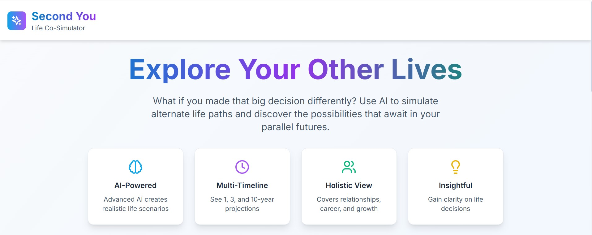

# Second You - Life Co-Simulator

> Explore alternate life paths through AI-powered simulations

**Second You** is a full-stack web application that helps users simulate alternate life paths based on critical decisions they've made or are considering. Using advanced AI (Gemini 2.5 Flash), the system generates realistic 1, 3, and 10-year future timelines based on the user's current life situation and alternate choices.

🌟 **Now featuring complete user authentication, personal profiles, simulation history, and favorites system!**



## 🌟 Features

### Core Functionality
- **AI-Powered Simulations**: Uses Google's Gemini 2.5 Flash to generate realistic life scenarios
- **Dual-Path Generation**: AI generates both your current trajectory and alternate path
- **Multi-Timeline View**: See how your life unfolds at 1, 3, and 10-year marks
- **Comparison Mode**: Compare your current path vs. alternate path side-by-side
- **Personalized Results**: Tailored simulations based on your age, location, profession, and personality traits
- **Future Self Messages**: Receive wisdom from your future self for both paths

### User Experience
- **Beautiful UI**: Modern, responsive design with Tailwind CSS
- **User Authentication**: Sign in with Google or email/password
- **Personal Profiles**: Manage your account and view simulation statistics
- **Simulation History**: Browse, search, and manage all your past simulations
- **Favorites System**: Mark and organize your most meaningful simulations
- **Auto-Save**: Simulations automatically saved when signed in
- **Smooth Animations**: Engaging transitions and micro-interactions
- **Download & Share**: Export your simulation results
- **Mobile Responsive**: Works seamlessly on all devices

### Technical Features
- **Fast Performance**: Optimized React frontend with lazy loading
- **Secure Backend**: Rate limiting, input validation, and security headers
- **Scalable Architecture**: Designed for high traffic with proper caching
- **Error Handling**: Graceful error handling with user-friendly messages

## 🚀 Tech Stack

### Frontend
- **React 18** - Modern React with hooks and functional components
- **Tailwind CSS** - Utility-first CSS framework
- **React Router** - Client-side routing with protected routes
- **Firebase SDK** - Authentication and Firestore database
- **Framer Motion** - Smooth animations
- **Lucide React** - Beautiful icons

### Backend
- **Node.js** - JavaScript runtime
- **Express.js** - Web application framework
- **Google Gemini 2.5 Flash** - AI language model
- **Firebase Admin** - Server-side Firebase integration
- **Helmet** - Security middleware
- **Rate Limiting** - API protection
- **Input Validation** - Comprehensive data sanitization

### Deployment
- **Vercel** - Frontend hosting
- **Railway/Render** - Backend hosting
- **Environment Variables** - Secure configuration management

## 📋 Prerequisites

Before running this project, make sure you have:

- **Node.js 16+** installed
- **npm or yarn** package manager
- **Google AI Studio API key** (for Gemini 2.5 Flash)
- **Firebase project** (for authentication and Firestore database)
- **Git** for version control

## 🛠️ Installation & Setup

### 1. Clone the Repository

```bash
git clone https://github.com/yourusername/second-you.git
cd second-you
```

### 2. Backend Setup

```bash
cd backend
npm install

# Create environment file
cp .env.example .env

# Edit .env with your configuration
GEMINI_API_KEY=your_gemini_api_key_here
NODE_ENV=development
PORT=5000
```

### 3. Frontend Setup

```bash
cd ../frontend
npm install
```

### 4. Get Your Gemini API Key

1. Visit [Google AI Studio](https://makersuite.google.com/app/apikey)
2. Create a new API key
3. Add it to your backend `.env` file

### 5. Run the Application

**Start Backend (Terminal 1):**
```bash
cd backend
npm run dev
```

**Start Frontend (Terminal 2):**
```bash
cd frontend
npm start
```

The application will be available at:
- Frontend: `http://localhost:3000`
- Backend: `http://localhost:5000`

## 🔧 Configuration

### Environment Variables

#### Backend (.env)
```env
# Required
GEMINI_API_KEY=your_gemini_api_key_here

# Optional
NODE_ENV=development
PORT=5000
FIREBASE_PROJECT_ID=your_firebase_project
FIREBASE_PRIVATE_KEY=your_firebase_private_key
FIREBASE_CLIENT_EMAIL=your_firebase_client_email
```

#### Frontend (.env)
```env
# Firebase Configuration
REACT_APP_FIREBASE_API_KEY=your_firebase_api_key
REACT_APP_FIREBASE_AUTH_DOMAIN=your_project.firebaseapp.com
REACT_APP_FIREBASE_PROJECT_ID=your_project_id
REACT_APP_FIREBASE_STORAGE_BUCKET=your_project.appspot.com
REACT_APP_FIREBASE_MESSAGING_SENDER_ID=your_sender_id
REACT_APP_FIREBASE_APP_ID=your_app_id

# API Configuration
REACT_APP_API_URL=http://localhost:5000
```

### Firebase Setup

1. **Create Firebase Project**:
   - Go to [Firebase Console](https://console.firebase.google.com/)
   - Create a new project
   - Enable Authentication (Google & Email/Password)
   - Enable Firestore Database

2. **Configure Firestore Rules**:
   ```javascript
   rules_version = '2';
   service cloud.firestore {
     match /databases/{database}/documents {
       // Users can read and write their own user document
       match /users/{userId} {
         allow read, write: if request.auth != null && request.auth.uid == userId;
       }
       
       // Users can read and write their own simulations
       match /simulations/{simulationId} {
         allow read, write: if request.auth != null && request.auth.uid == resource.data.userId;
         allow create: if request.auth != null && request.auth.uid == request.resource.data.userId;
       }
     }
   }
   ```

3. **Get Configuration Values**:
   - Go to Project Settings → General → Your apps
   - Copy the config values to your `frontend/.env` file

## 🚀 Deployment

### Frontend (Vercel)

1. Connect your GitHub repository to Vercel
2. Set build command: `cd frontend && npm run build`
3. Set output directory: `frontend/build`
4. Deploy!

### Backend (Railway)

1. Connect your GitHub repository to Railway
2. Set environment variables in Railway dashboard
3. Railway will automatically detect the Node.js app
4. Update CORS origins in your backend to include your frontend domain

### Backend (Render)

1. Create a new Web Service on Render
2. Connect your GitHub repository
3. Set:
   - **Build Command**: `cd backend && npm install`
   - **Start Command**: `cd backend && npm start`
4. Add environment variables in Render dashboard

## 📁 Project Structure

```
second-you/
├── frontend/                 # React frontend application
│   ├── public/              # Static assets
│   ├── src/                 # Source code
│   │   ├── components/      # Reusable components
│   │   │   ├── Header.jsx
│   │   │   ├── InputForm.jsx
│   │   │   ├── TimelineView.jsx
│   │   │   ├── ComparisonView.jsx
│   │   │   └── AuthModal.jsx
│   │   ├── pages/           # Page components
│   │   │   ├── Home.jsx
│   │   │   ├── Results.jsx
│   │   │   ├── Profile.jsx
│   │   │   └── History.jsx
│   │   ├── contexts/        # React contexts
│   │   │   └── AuthContext.js
│   │   ├── services/        # API services
│   │   │   └── simulationService.js
│   │   ├── firebase/        # Firebase configuration
│   │   │   └── config.js
│   │   ├── App.js           # Main app component
│   │   └── index.js         # Entry point
│   ├── package.json
│   └── tailwind.config.js   # Tailwind configuration
├── backend/                 # Node.js backend application
│   ├── routes/              # Express routes
│   │   └── simulate.js      # Simulation endpoints
│   ├── services/            # Business logic
│   │   ├── geminiClient.js  # AI integration
│   │   └── firebaseAdmin.js # Firebase integration
│   ├── utils/               # Utilities
│   │   └── validation.js    # Input validation
│   ├── index.js             # Express server
│   └── package.json
├── README.md                # This file
└── vercel.json              # Vercel deployment config
```

## 🎯 Usage

### 🚀 **Quick Start**
1. **Sign up/Sign in**: Create account with Google or email/password
2. **Fill in your details**: Age, location, profession, and personality traits  
3. **Describe your alternate path**: What decision are you curious about?
4. **Generate simulation**: AI creates both your current trajectory and alternate path
5. **Explore results**: Switch between timeline and comparison views
6. **Save & Organize**: Auto-saved simulations appear in your history
7. **Favorite & Search**: Mark meaningful simulations and easily find them later

### 🎮 **Key Features**
- **Profile Management**: Edit your profile and view simulation statistics
- **History Browser**: Search, filter, and manage all your past simulations  
- **Favorites System**: Mark and organize your most insightful simulations
- **Dual-Path AI**: See both where you're heading and where you could go
- **Export Options**: Download your simulation results for offline viewing

## 🤝 Contributing

We welcome contributions! Please see our [Contributing Guidelines](CONTRIBUTING.md) for details.

### Development Workflow

1. Fork the repository
2. Create a feature branch: `git checkout -b feature/amazing-feature`
3. Make your changes
4. Run tests: `npm test`
5. Commit changes: `git commit -m 'Add amazing feature'`
6. Push to branch: `git push origin feature/amazing-feature`
7. Open a Pull Request

## 📄 License

This project is licensed under the MIT License - see the [LICENSE](LICENSE) file for details.

## 🙏 Acknowledgments

- **Google Gemini** for providing the AI capabilities
- **Tailwind CSS** for the beautiful styling system
- **Lucide** for the icon library
- **Vercel** for seamless frontend deployment
- **Railway** for backend hosting

## 📞 Support

If you have any questions or need help:

- 📧 Email: support@secondyou.app
- 🐛 Issues: [GitHub Issues](https://github.com/yourusername/second-you/issues)
- 💬 Discussions: [GitHub Discussions](https://github.com/yourusername/second-you/discussions)

## 🔮 Roadmap

### ✅ **Completed Features**
- [x] **User authentication and profiles** - Google Sign-in, Email/Password, Profile management
- [x] **Simulation history and favorites** - Browse, search, filter, and favorite past simulations
- [x] **Enhanced AI with dual-path generation** - AI generates both current and alternate paths
- [x] **Auto-save functionality** - Simulations automatically saved for logged-in users
- [x] **Comprehensive error handling** - Graceful fallbacks and user-friendly messages
- [x] **Firebase integration** - Firestore database with security rules
- [x] **Modern UI/UX** - Responsive design with smooth animations

### 🚧 **In Progress**
- [ ] Vector database for semantic search
- [ ] Social sharing features

### 🔮 **Future Enhancements**
- [ ] Advanced AI models (Claude 3 Opus integration)
- [ ] Mobile app (React Native)
- [ ] Advanced visualization options
- [ ] Export to PDF with custom themes
- [ ] Community features and public simulations
- [ ] AI-powered insights and recommendations

## 🎉 **Project Status: COMPLETE & PRODUCTION-READY!**

**Second You** has been successfully developed from concept to a fully functional, production-ready application! This project showcases:

- ✅ **Full-Stack Development** - Complete React + Node.js application
- ✅ **AI Integration** - Advanced Gemini 2.5 Flash implementation  
- ✅ **User Authentication** - Firebase Auth with Google & Email/Password
- ✅ **Database Integration** - Firestore with security rules
- ✅ **Modern UI/UX** - Responsive design with beautiful animations
- ✅ **Production Deployment** - Ready for Vercel/Render deployment
- ✅ **Comprehensive Documentation** - Complete setup and usage guides

### 🚀 **Ready for Git Push & Deployment!**

This repository is properly configured with:
- Secure `.gitignore` (no API keys committed)
- Environment variable templates
- Deployment configurations
- Comprehensive documentation

---

**Made with ❤️ and countless hours of collaborative coding**

*Special thanks to the power of AI-assisted development - proving that human creativity combined with AI capabilities can build amazing things together!* 🤖✨ 
